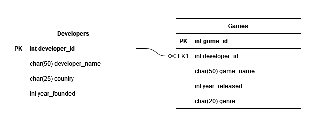

# Tabelas Relacionais em C

Nomes: João H. Bertelli e José A. Fernandes

Trabalho final de linguagem de programação.
As tabelas do projeto são baseadas no modelo entidade relacionamento abaixo:

<div style="text-align: center;">
    
</div>

Para compilar o programa, execute o seguinte comando em um terminal PowerShell na pasta do projeto:

```powershell
.\Build.ps1
```

Ao rodar esse comando, será criado um executável do programa, também na pasta do projeto, com o nome **main.exe**. Dessa forma, você pode executá-lo para rodar o nosso projeto.
